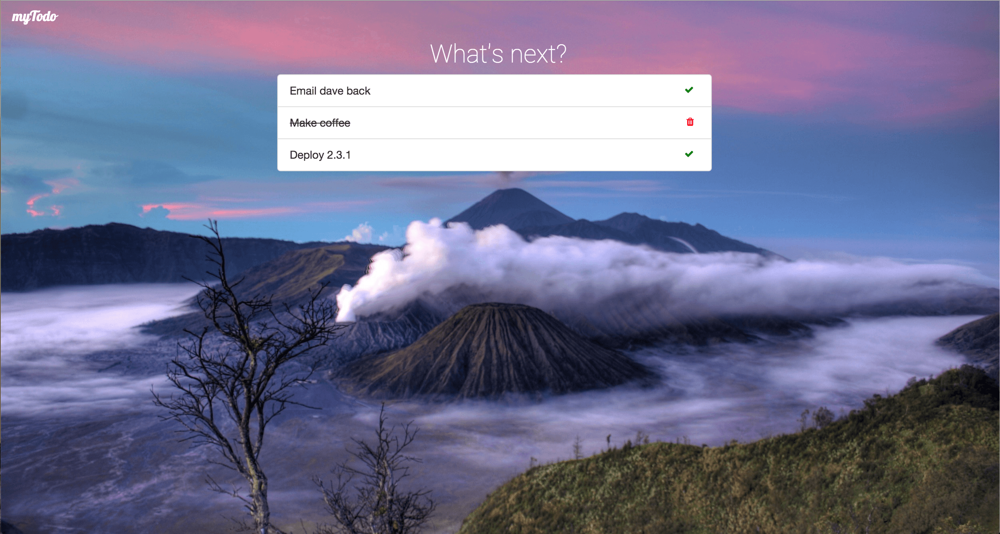

#myTodo

A google chrome extension that takes over the new tab page - and replaces it with a todo list which can have items added, marked as completed, and removed.

##Colophon
Background images were sourced from [The Stocks.](http://thestocks.im/)

Fonts from [Google Fonts](https://www.google.com/fonts)

Frameworks and javascript libraries used:
  - [jQuery](http://jquery.com/)
  - [Bootstrap](http://getbootstrap.com/)
  - [Backstretch](http://srobbin.com/jquery-plugins/backstretch/)
  - [FontAwesome](http://fortawesome.github.io/Font-Awesome/)
